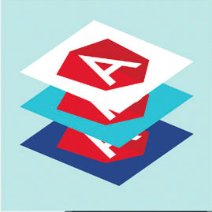

# AngularJS Training

Welcome to *AngularJS Training*, a hands-on training for developers like you and me!

The training consists of several modules, each teach and train individual aspects of AngularJS and related tools. Your instructor will guide you through these modules based on your chosen picks of modules and arrangements.

## Getting started

Before your first training session, ensure that the following tools and libraries have been set up correctly.

### Step 1: Setup node.js, npm, git and bower

- Install node.js and npm (<http://nodejs.org>)
- Install git (<http://git-scm.com/>)
- Install bower via npm (<http://bower.io/>)

Verify that all installed applications work from command-line and that they all are fresh versions.

The following setup is confirmed to work:

    > node --version
    v0.10.33

    > npm --version
    v1.4.28

    > git --version
    git version 1.9.5

    > bower --version
    1.3.12

### Step 2: Setup your favourite editor

Ensure that the editor/IDE of your choice has sufficient JavaScript support. Note that most of the tools work just find from command-line so IDE support for most tools is optional.

Alternatively or in addition, you can download and install Atom (<https://atom.io/>).

### IntelliJ Idea / WebStorm

- IntelliJ Idea has built-in support for Javascript.
- Install and activate NodeJS plugin if you want support for node and JavaScript build tools (<https://www.jetbrains.com/idea/features/nodejs.html>).

###  Eclipse Platform

- Install and activate Nodeclipse (http://www.nodeclipse.org/)

### NetBeans

- NetBeans 8+ has built-in support for everything you need (JavaScript, node, etc.)
- For older versions of NetBeans, complete your tool support with NodeJS plugin (<http://plugins.netbeans.org/plugin/36653/nodejs>)

### Step 3: Setup angular-seed project template

Make a copy of angular-seed project into your work folder:

    https://github.com/gofore/angular-mini-seed

Ensure your tool setup works by starting the project with:

    npm start

Open your web browser and navigate to <http://localhost:8000/app/>

If everything works, you should see the sample application.

**Troubleshooting**: if something doesn't work, ensure all the above commands work as they should (node, npm, git, bower). If any of these tools fail, debug and fix them and attempt again.

### Step 4: Setup test frameworks

**If you attend the testing part of the training**, install the following tools:

    npm install -g karma-cli
    npm install -g protractor

Ensure that the packages have been correctly installed as follows:

    > karma --version
    Karma version: 0.12.31

    protractor --version
    > Version 1.8.0

As a final verification step, run the tools against fresh copy of Angular seed project:

    git clone https://github.com/angular/angular-seed angular-seed-tests
    cd angular-seed-tests
    npm test
    
    
### Training agenda

### Day 1

- [Introduction to single page applications](presentations/01-intro-to-spa.md)
- [Introduction to AngularJS](presentations/02-angular-intro.html)
- [Async and network programming](presentations/03-async-and-network.html)
- [Resources](presentations/04-resources.html)
- [Directives](presentations/05-directives.html)
- [Promises](presentations/06-promises.html)
- [Routing](presentations/07-routing.html)
- [Testing](presentations/08-testing.html)

