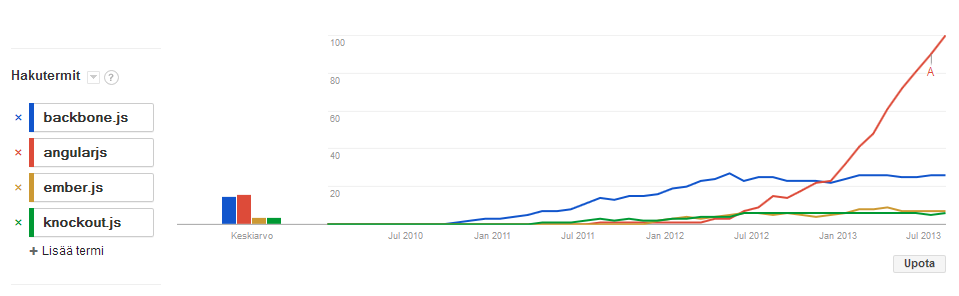
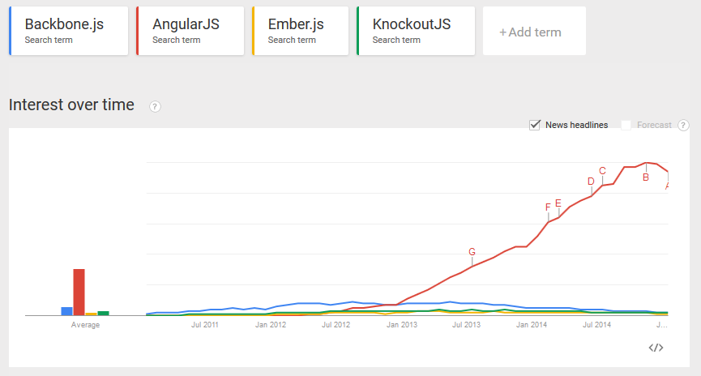

## Introduction to Single-Page Web Applications

---

## Background

----

## Static web pages &rarr; DHTML &rarr; AJAX &rarr; SPA

----

## SPA

- SPA SPA = Single-Page (Web) Application
- Further advances the AJAX way of communicating with the server
- Instead of page transitions, persist state by changing browser URL via JavaScript APIs
- Retrieve a page only once and keep modifying its state via DOM without whole page reloads

----

## Benefits

- Potential for improved user experience (more control over application states; ability to animate state transitions)
- Reduced bandwidth usage, improved performance
- Create more native-like applications
- Facilitate clean, nicely decoupled client/server architecture

---

## Libraries and Frameworks

----

## Why bother?

- You can write SPA apps with plain JavaScript
- Libraries: provide tools that solve specific problems
- Frameworks: provide full set of tools for a use case
- **Don't reinvent the wheel**

---

## Backbone.js

The first major, widely-adopted MV* JavaScript framework

- Minimal by design; only provides the barebones of an MV (Model-View) app
- Fast to learn and easy to get into for JavaScript developers
- Large applications tend to end up being boilerplate-heavy and repetitive

---

## Ember.js

Huge MVC framework for building "ambitious" web applications.

- Very opinionated, relies heavily on conventions
- Two-way data binding
- Own persistence layer (Ember Data)
- Massive (250kb minified), huge API
- Controls your whole front-end application, not suitable for small "islands of richness"

---

## Knockout

Model-View-ViewModel (MVVM) framework with templates

- Data binding using MVVM
- Logic in JavaScript and data- attributes
- Templating

----

## [Knockout Demo](https://jsfiddle.net/lhahne/qggpetnq/)

---

## Angular.js 

- Immensely popular MV* framework by Google.
- Fairly opinionated and makes many choices for you (-> productivity, shared language)
- Declarative two-way data binding out of the box
- Extends HTML vocabulary with a DSL known as *directives*, patterned after the emerging Web Components standard

----

- Built from the ground up with testability in mind
- Solid performance in most cases, but you may have to do some optimizations when rendering large data sets
- Lots of new, proprietary concepts to learn, which can steepen the learning curve for some

----

### Some Google Trends 2010-2013

----

### 2011-2015

----

## [Angular.js Demo](https://jsfiddle.net/lhahne/ftguL11x/)

---

## [React](https://facebook.github.io/react/)

- Facebook's open source library
- A super fast rendering layer based on virtual dom
- Offers no data binding
- Create custom components and nest them
- Just a view layer implementation
- JSX

----

## [Flux](https://facebook.github.io/flux/docs/overview.html)

- Client-side application architecture
- Complements React
- Unidirectional data flow:
  - Action &rarr; Dispatcher &rarr; Store &rarr; View

----

## [React Demo](https://jsfiddle.net/lhahne/nq1uh6jj/)

---

## Angular 2.0

- A complete rewrite of Angular
- Shadom DOM, ES6 modules
- Encourages static typing with TypeScript
- Still alpha, mixed reception
- [Router](https://github.com/angular/router) backported to Angular 1.4

**Watch closely, but use 1.x series today**

----

## [AngularJS 2 demo](https://jsfiddle.net/rautamar/1y0tw6zf/)

---